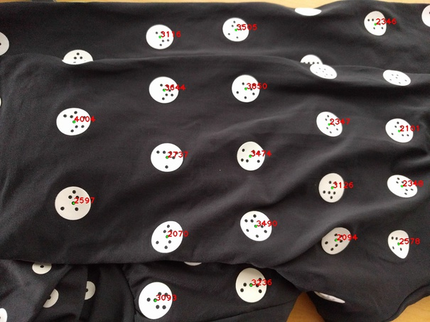

# ZoCap

T.B.W.

## Status

Very early stage.
Detect marker using C++ + OpenCV.

## Requirements

* OpenCV
* CMake

## TODO

* [ ] Robust marker detection
* [ ] Map marker position to 3D human shape(e.g. MakeHuman)

## Acknowledgements

* Original marker detection code by @ksasao https://gist.github.com/ksasao/bc9c548d5e38932f2d0d11912ba541d0

## License

Apache 2.0 License.
